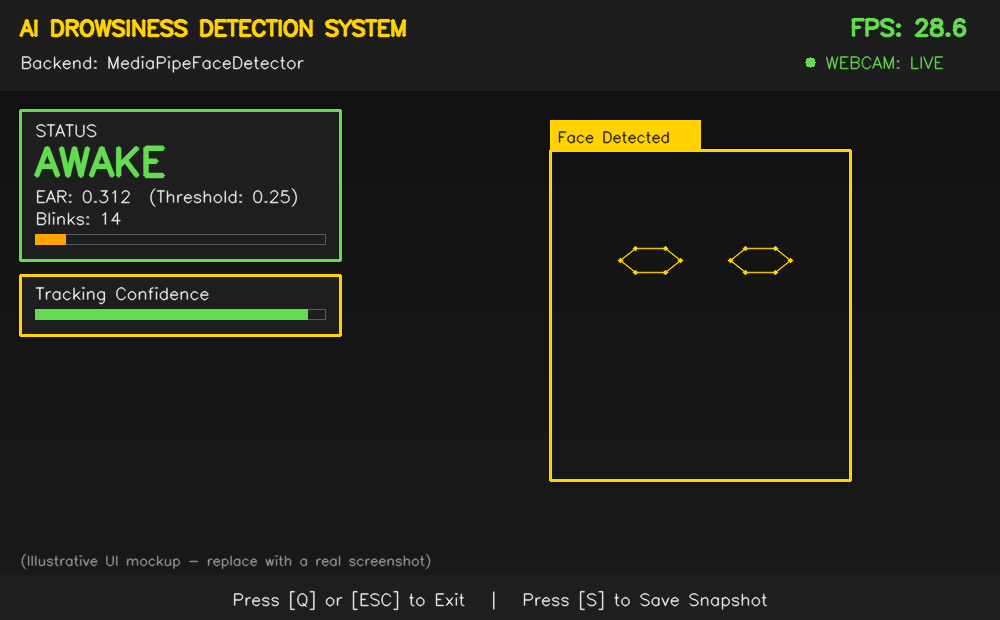

<p align="center">
  
</p>

<h1 align="center">AI Drowsiness Detection System</h1>

<p align="center">
  A real-time computer vision safety system that monitors eye closure via Eye Aspect Ratio (EAR) analysis and raises an audible + visual alarm the instant sustained drowsiness is detected — built with a dual detection-backend architecture and production-grade software design.
</p>

<p align="center">
  
  
  
  
  
  
</p>

---

## 📌 Project Description

**AI Drowsiness Detection System** is a real-time safety-monitoring application that watches a person's eyes through a standard webcam and computes the **Eye Aspect Ratio (EAR)** — a well-established, research-backed metric (Soukupová & Čech, 2016) that stays roughly constant while eyes are open and drops sharply as they close. When the EAR remains below a configurable threshold for a sustained period, the system distinguishes this from a normal blink and escalates to a **"Drowsy"** state, triggering both a visual on-screen alarm and an audible siren.

Rather than a single hard-coded detection method, this project is engineered around a **dual detection-backend architecture**: a default **MediaPipe Face Mesh** backend that works immediately after installing dependencies with zero external downloads, and an optional **dlib** backend (HOG detector + 68-point landmark predictor) reflecting the classic academic approach the EAR technique was originally published with. Both backends normalize their output into an identical data contract, so the entire downstream EAR-computation, drowsiness state-machine, and alarm logic is completely backend-agnostic and independently unit-testable.

This project was built as part of an **AI & Machine Learning Diploma** portfolio to demonstrate applied computer vision engineering, real-time signal-processing state-machine design, and professional documentation practices suitable for GitHub, LinkedIn, and academic evaluation.

---

## ✨ Features

| Category | Capability |
|---|---|
| **Detection** | Real-time face detection with 2 interchangeable backends (MediaPipe / dlib) |
| **Eye Tracking** | High-accuracy 6-point eye-contour landmark extraction per eye |
| **EAR Analysis** | Eye Aspect Ratio computed via SciPy Euclidean distance, exactly per the original research formula |
| **Signal Smoothing** | Moving-average EAR smoothing to filter out landmark-jitter noise |
| **Blink vs. Drowsiness** | Time-based (not frame-count-based) state machine correctly distinguishes a normal blink from a sustained, dangerous eye closure |
| **Live Status** | Real-time **AWAKE** / **DROWSY** status panel with color-coded accents |
| **Audible Alarm** | Threaded, non-blocking, cooldown-protected siren playback that never freezes the video loop |
| **Blink Counter** | Live tally of normal blinks across the session |
| **FPS Counter** | Exponentially-smoothed, real-time frame-rate readout |
| **Confidence Display** | Live tracking-confidence indicator (backend-appropriate: EMA stability for MediaPipe, real HOG+SVM score for dlib) |
| **Webcam Status** | Connectivity indicator with automatic reconnect attempts |
| **Adjustable Sensitivity** | EAR threshold and drowsy-duration threshold both tunable from `config/settings.py`, plus a runtime `set_ear_threshold()` API |
| **Robustness** | Full exception handling — camera errors, missing models, and alarm-playback failures are all caught and reported cleanly instead of crashing |
| **UX** | Keyboard shortcuts: `Q` / `ESC` to exit, `S` to save a timestamped snapshot |
| **UI/UX** | Professional translucent overlay panels, rounded corners, pulsing full-screen drowsy alert banner, eye-contour visualization |
| **Engineering** | Modular OOP architecture, PEP8-compliant, fully typed, docstring-documented, unit-tested detection/logic layer |

---

## 🛠️ Technology Stack

- **Language:** Python 3.12+
- **Computer Vision:** [OpenCV](https://opencv.org/) — video capture, image processing, real-time UI rendering
- **Primary Landmark Model:** [MediaPipe Face Mesh](https://developers.google.com/mediapipe) — 468-point face mesh (6-point eye subset used for EAR)
- **Optional Landmark Model:** [dlib](http://dlib.net/) — HOG face detector + 68-point `shape_predictor`, the classic EAR-research pipeline
- **Landmark Utilities:** [imutils](https://github.com/PyImageSearch/imutils) — `face_utils.shape_to_np` and named 68-point index ranges for the dlib backend
- **Numerical Computing:** [NumPy](https://numpy.org/) — array and coordinate operations
- **Distance Computation:** [SciPy](https://scipy.org/) (`scipy.spatial.distance`) — Euclidean distance for the EAR formula
- **Audio Alarm:** [playsound](https://github.com/TaylorSMarks/playsound) — lightweight, dependency-free `.wav` playback
- **Architecture:** Modular, object-oriented, single-responsibility Python package

---

## 📥 Installation

### Prerequisites
- Python **3.12 or higher**
- A working webcam
- pip (Python package manager)

### Steps

```bash
# 1. Clone the repository
git clone https://github.com/abidcore/AI-Drowsiness-Detection-System.git
cd AI-Drowsiness-Detection-System

# 2. (Recommended) Create and activate a virtual environment
python -m venv venv

# Windows
venv\Scripts\activate

# macOS / Linux
source venv/bin/activate

# 3. Install dependencies
pip install -r requirements.txt
```

> 💡 The **default MediaPipe backend requires nothing further** — you're ready to run the app immediately after this step.

### Enabling the dlib Backend (Optional)

The dlib backend requires a one-time ~100 MB landmark model download. See [`models/README.md`](models/README.md) for full instructions, or the short version:

1. Set `DETECTION_BACKEND = "dlib"` in `config/settings.py`.
2. Run `python main.py` — the model will be **auto-downloaded** on first launch (requires internet access), or download it manually from http://dlib.net/files/shape_predictor_68_face_landmarks.dat.bz2, decompress it, and place the `.dat` file in `models/`.
3. If the model is ever missing, the app **automatically and safely falls back to MediaPipe** with a clear console warning rather than crashing.

---

## ▶️ Usage

Run the application from the project root:

```bash
python main.py
```

### Keyboard Shortcuts

| Key | Action |
|---|---|
| `Q` or `ESC` | Exit the application |
| `S` | Save a timestamped snapshot to `snapshots/` |

### Adjusting Detection Sensitivity

Open `config/settings.py` and tune:

```python
EAR_THRESHOLD = 0.25                      # Lower = less sensitive, higher = more sensitive
DROWSY_DURATION_THRESHOLD_SECONDS = 1.5   # How long eyes must stay closed to trigger the alarm
BLINK_MAX_DURATION_SECONDS = 0.4          # Closures shorter than this are treated as normal blinks
```

### Running in VS Code
1. Open the project folder in VS Code.
2. Select the interpreter from your `venv` (`Ctrl+Shift+P` → *Python: Select Interpreter*).
3. Run `main.py` directly, or use the integrated terminal: `python main.py`.

---

## 📁 Folder Structure

```
AI-Drowsiness-Detection-System/
│
├── main.py                       # Application entry point & orchestration
├── requirements.txt                # Python dependencies
├── README.md                        # Project documentation (this file)
├── LICENSE                           # MIT License
├── .gitignore                         # Git ignore rules
│
├── src/                                 # Core application package
│   ├── __init__.py                       # Package exports
│   ├── face_detector.py                  # Dual-backend (MediaPipe/dlib) face & eye landmark detection
│   ├── eye_tracker.py                    # EAR computation (SciPy) + signal smoothing
│   ├── drowsiness_detector.py            # Time-based drowsiness state machine
│   ├── alarm.py                          # Threaded, cooldown-protected alarm playback
│   ├── fps.py                            # Smoothed FPS counter
│   └── utils.py                          # Drawing helpers, eye-contour visualization
│
├── config/                                # Centralized configuration
│   ├── __init__.py
│   └── settings.py                         # All tunable constants (sensitivity, camera, UI, alarm)
│
├── models/                                  # dlib landmark model (optional, not version-controlled)
│   └── README.md                             # Download / setup instructions
│
├── assets/                                    # Visual & audio assets
│   ├── logo.png
│   ├── demo.png
│   └── alarm.wav                               # Real, synthesized two-tone alarm siren
│
└── docs/                                        # Extended documentation
    └── project_report.md                         # Full academic-style project report
```

---

## 🔄 System Workflow

1. **Capture** — Read a frame from the webcam.
2. **Detect** — Locate the face and extract 6-point eye-contour landmarks per eye (via MediaPipe or dlib).
3. **Measure** — Compute the Eye Aspect Ratio for each eye using `scipy.spatial.distance.euclidean`, then average both eyes.
4. **Smooth** — Apply a moving-average filter to the EAR signal to suppress landmark jitter.
5. **Classify** — Feed the smoothed EAR into the time-based drowsiness state machine, which tracks continuous closure duration and distinguishes a normal blink from sustained drowsiness.
6. **Alert** — If drowsy, trigger the threaded audible alarm (respecting a cooldown) and display a pulsing full-screen visual warning.
7. **Render** — Draw the professional UI overlay: top status bar, live status panel, tracking-confidence panel, eye-contour visualization, and footer.
8. **Loop** — Repeat in real time until the user exits.

---

## 🖼️ Screenshots

<p align="center">
  
</p>

> The image above is an illustrative UI mockup generated to preview the layout. Replace `assets/demo.png` with an actual screenshot or GIF of the running application for your submission/portfolio.

---

## ✅ Advantages

- **Dual-backend architecture** — runs out-of-the-box with MediaPipe, while still supporting the classic dlib research pipeline for academic fidelity.
- **Blink-aware, not just threshold-aware** — a time-based state machine correctly separates normal blinking from genuine drowsiness, unlike naive "N consecutive frames" tutorials.
- **FPS-independent timing** — all duration logic uses wall-clock time, not frame counts, so behavior is consistent across different hardware.
- **Never freezes the video feed** — alarm playback runs on a background thread with cooldown protection.
- **Fails gracefully** — camera errors, missing dlib models, and audio-playback failures are all caught and clearly reported without crashing.
- **Fully adjustable sensitivity** — every threshold lives in one settings file, plus a runtime API for dynamic adjustment.
- **Portfolio-ready** — clean PEP8 code, full docstrings, and academic-grade documentation.

---

## 🚀 Future Scope

- Add **head-pose estimation** (nodding detection) as a secondary drowsiness signal alongside EAR.
- Integrate **yawn detection** via mouth-aspect-ratio analysis for a more complete fatigue picture.
- Log drowsiness events with timestamps to a CSV/database for post-session analytics.
- Add a **calibration phase** at startup that learns each user's personal baseline EAR for more precise thresholds.
- Build a **mobile/embedded deployment** (e.g. Raspberry Pi + dash-cam form factor) for real in-vehicle use.
- Add an automated **pytest suite** with CI integration covering `eye_tracker.py` and `drowsiness_detector.py`.
- Integrate **push notifications / fleet-management dashboard** connectivity for commercial driver-monitoring use cases.

---

## 📄 License

This project is licensed under the **MIT License** — see the [LICENSE](LICENSE) file for details.

---

## 👤 Author

**Abid Ali**
AI & Machine Learning Diploma Student

- GitHub: [github.com/abidcore](https://github.com/abidcore)
- LinkedIn: [linkedin.com/in/abid-ali-shaikh-03a591423](https://www.linkedin.com/in/abid-ali-shaikh-03a591423)
- Email: [abidalishaikh2007@gmail.com](mailto:abidalishaikh2007@gmail.com)

---

<p align="center">⭐ If you found this project useful, consider giving it a star on GitHub!</p>
